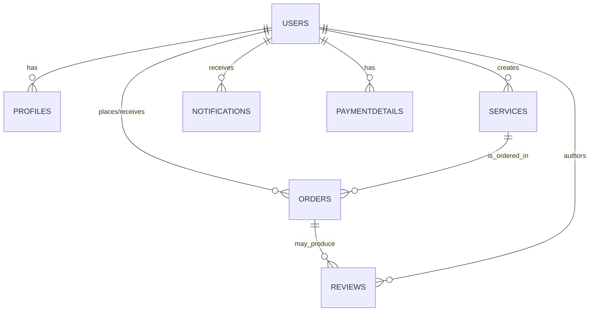

# INJAZ-Frontend

## Overview

INJAZ Frontend is a single-page React application that provides a freelancer marketplace UX: browsing services, searching, creating services (for sellers), placing orders, and managing profiles. It is an internationalized (i18n) frontend that expects a separate backend API to provide authentication, data persistence, payments, and admin endpoints. The app is intended for buyers, sellers (freelancers), and site administrators.

## Screenshots

- Logo / brand asset included in the repo:

  

If you want to add full-page screenshots, place them in `public/` or `src/assets/` and reference them here.

## Technologies Used

- Frontend: React (v19), Vite
- Routing: react-router
- HTTP / API: axios (used directly and via a central `api` wrapper)
- Internationalization: i18next / react-i18next
- Styling: project CSS files (Tailwind is present as a devDependency but the app uses CSS files in `src/`)
- Build / Dev tools: Vite, ESLint

Dependencies (from `package.json`): `react`, `react-dom`, `react-router`, `axios`, `i18next`, `react-i18next`, `country-list`, `emoji-picker-react`.

## Getting Started

Requirements:
- Node.js and npm (the project uses standard npm scripts in `package.json`)
- A running backend API server reachable from the frontend. The frontend reads the backend base URL from the environment variable `VITE_BACK_END_SERVER_URL` (see `src/services/api.js`). Many API calls also reference `http://localhost:3000/` (some service files use explicit localhost URLs), so ensure your backend is available at the configured URL.

Environment variables (example):

Create a `.env` file in the project root with at least:

```env
VITE_BACK_END_SERVER_URL=http://localhost:3000
```

## Installation

1. Install dependencies:

```bash
npm install
```

2. Run the development server:

```bash
npm run dev
```

3. Build for production:

```bash
npm run build
```

4. Lint the codebase:

```bash
npm run lint
```

## User Stories

- As a user, I want to browse and search services, so that I can find freelancers for a task.
- As a user, I want to create an account and sign in, so that I can place orders and manage my profile.
- As a seller (freelancer), I want to create and edit services, so that I can offer work to buyers.
- As a buyer, I want to place an order and pay, so that the seller can start work.
- As a user, I want to view my profile and edit my information, so I can keep my details up to date.
- As an admin, I want to view stats and manage users/services/orders/reviews (admin dashboard pages exist in frontend), so I can moderate the platform.
- As a user, I want to receive and mark notifications as read.

## Database Design

Note: This repository contains the frontend only; the backend implementation and database are expected to be provided separately. The frontend interacts with a REST API and expects the following logical entities and relationships (inferred from the API calls present in the code):

- Users
  - Fields (inferred): `_id`, `username`, `email`, `passwordHash`, `isSeller`, `role`, `avatarUrl`, profile details

- Profiles
  - Fields (inferred): `_id`, `userId` (ref -> Users), `bio`, `skills`, `location`, `paymentDetails`

- Services
  - Fields: `_id`, `title`, `description`, `price`, `deliveryTime`, `category`, `images[]`, `freelancer` (ref -> Users/Profile), `rating`

- Orders
  - Fields: `_id`, `serviceId` (ref -> Services), `buyerId` (ref -> Users), `sellerId` (ref -> Users), `price`, `status`, `createdAt`

- Reviews
  - Fields: `_id`, `orderId` (ref -> Orders), `serviceId` (ref -> Services), `authorId` (ref -> Users), `rating`, `content`

- Notifications
  - Fields: `_id`, `userId` (ref -> Users), `message`, `read`, `meta`

- PaymentDetails
  - Fields: `_id`, `userId` (ref -> Users), `provider`, `details` (e.g., tap/account info)

Mermaid ER (inferred):



## Routes

The frontend expects (and calls) the following backend API endpoints. These are derived directly from service modules and page fetch/axios calls in `src/`.

| Method | Route | Description |
|--------|-------|-------------|
| POST | /auth/sign-up | Register a new user (used by signup) |
| POST | /auth/sign-in | Authenticate user and return access token |
| GET | /auth/me | Get current authenticated user |
| POST | /auth/forgot-password | Request password reset (forgot password) |
| POST | /auth/reset-password/:token | Reset password using token |
| GET | /services | List services (with optional query params like `?category=`) |
| GET | /services/popular-searches | Get popular search terms shown on homepage |
| POST | /services | Create a service (multipart/form-data) |
| GET | /services/:id | Get service details |
| DELETE | /services/:id | Delete a service |
| PUT | /services/:id | Update a service (inferred — edit page exists) |
| GET | /services/profile/:id | Get services for a freelancer/profile |
| GET | /reviews/service/:serviceId | Get reviews for a service |
| GET | /reviews/profile/:userId | Get reviews for a freelancer/profile |
| POST | /reviews/order/:orderId | Create a review for an order |
| PUT | /reviews/:reviewId | Update a review |
| DELETE | /reviews/:reviewId | Delete a review |
| POST | /orders | Create an order (used by checkout / service order flow) |
| GET | /orders/my-orders | Get orders for current user (dashboard) |
| GET | /orders/:orderId | Get specific order (workspace/chat pages) |
| PUT | /orders/:orderId/status | Update order status (seller actions) |
| POST | /payments/:orderId | Create a payment session (Tap integration expected) |
| GET | /payments/verify?tap_id=... | Verify payment callback (used by PaymentCallback page) |
| GET | /notifications | Get notifications for current user |
| PUT | /notifications/:id/read | Mark a notification as read |
| PUT | /notifications/read-all | Mark all notifications as read |
| GET | /payment-details | Get current user payment details |
| POST | /payment-details | Create payment details |
| PUT | /payment-details | Update payment details |
| DELETE | /payment-details | Delete payment details |
| GET | /profile/me | Get current user's profile |
| GET | /profile/:id | Get another user's profile |
| PUT | /profile | Update profile |
| DELETE | /profile | Delete profile/account |
| GET | /admin/stats | Admin: get platform statistics (requires admin auth) |
| GET | /admin/users | Admin: list users |
| PUT | /admin/users/:userId/role | Admin: update user role |
| DELETE | /admin/users/:userId | Admin: delete a user |
| GET | /admin/services | Admin: list services |
| DELETE | /admin/services/:serviceId | Admin: delete a service |
| GET | /admin/orders | Admin: list orders |
| DELETE | /admin/orders/:orderId | Admin: delete an order |
| GET | /admin/reviews | Admin: list reviews |
| DELETE | /admin/reviews/:reviewId | Admin: delete a review |

> Note: Many fetch/axios calls in the frontend use `http://localhost:3000/...` directly; others use the `api` wrapper which reads `VITE_BACK_END_SERVER_URL`. Make sure your backend exposes the above routes and CORS to the frontend origin.

## Features

- Authentication: sign-up, sign-in, sign-out, current user (`/auth/me`), forgot/reset password flows.
- Marketplace features:
  - Browse services, search, category filters
  - Service detail pages with image gallery, ordering flow and Tap payment integration
  - Create / edit services (seller flows)
- Orders and workspace:
  - Create orders, order workspace, order chat, order status updates (seller side)
- Profiles:
  - View and edit user profile, view freelancer profile and their services
- Reviews:
  - Create, update, delete reviews tied to orders/services
- Notifications: fetch and mark read
- Admin UI (frontend pages exist) to view stats and manage users/services/orders/reviews (backend endpoints must be implemented and secured)
- Internationalization: Arabic and English translations are present (`src/locales`)
- Loading states: app uses centralized loading UI components (loader components under `src/components/loading-ui/`) and visual placeholders

## Future Enhancements

- Provide an included backend implementation (this repo contains frontend only). A minimal Express + MongoDB backend matching the documented routes would enable full local end-to-end testing.
- Add automated tests (unit + integration) for key pages and services.
- Add CI/CD pipeline and preview deployments.
- Improve chunking / code-splitting to reduce production bundle size (Vite reported large chunks during build).
- Add explicit guidance for Node engine version in `package.json` and a reproducible `.nvmrc` file.

## Credits

- Project and UI code: repository source
- Libraries: React, Vite, axios, i18next, react-router
- Assets: `src/assets/INJAZ-LOGO-tran.svg`
